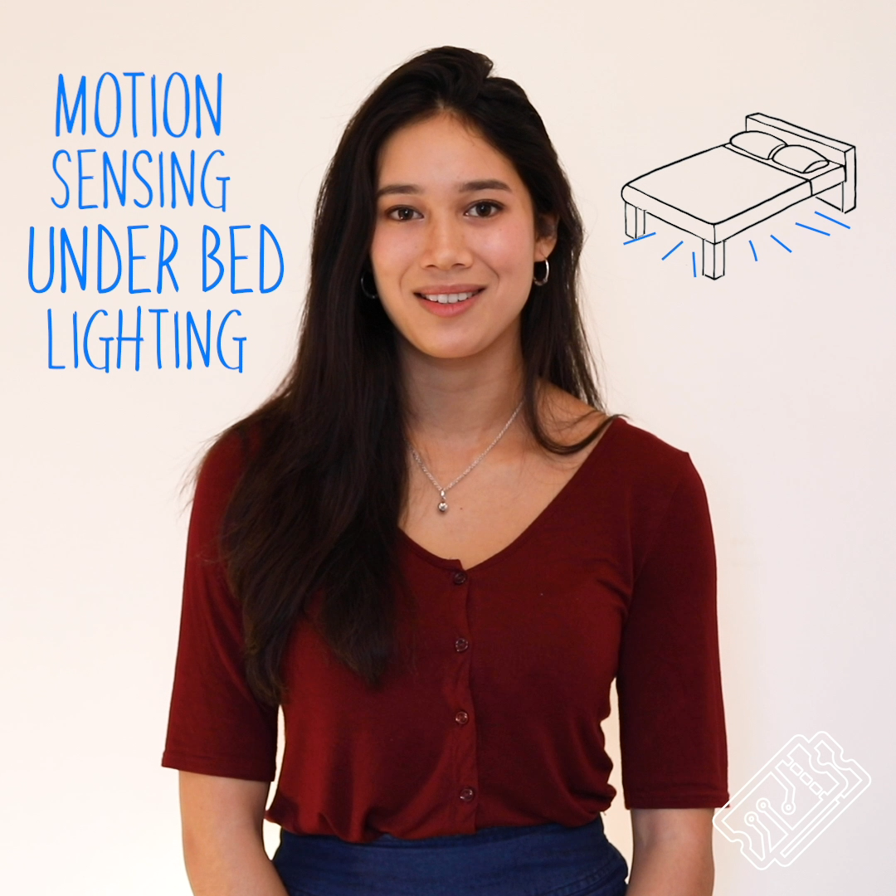
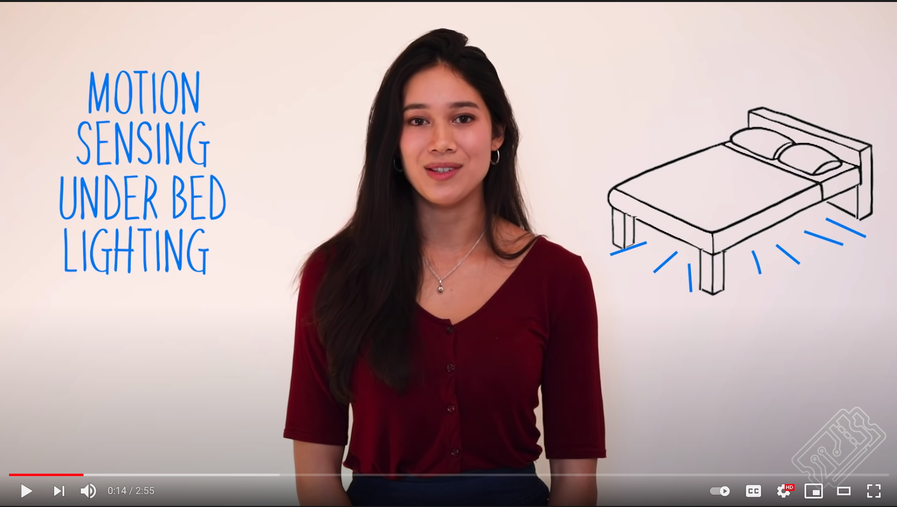
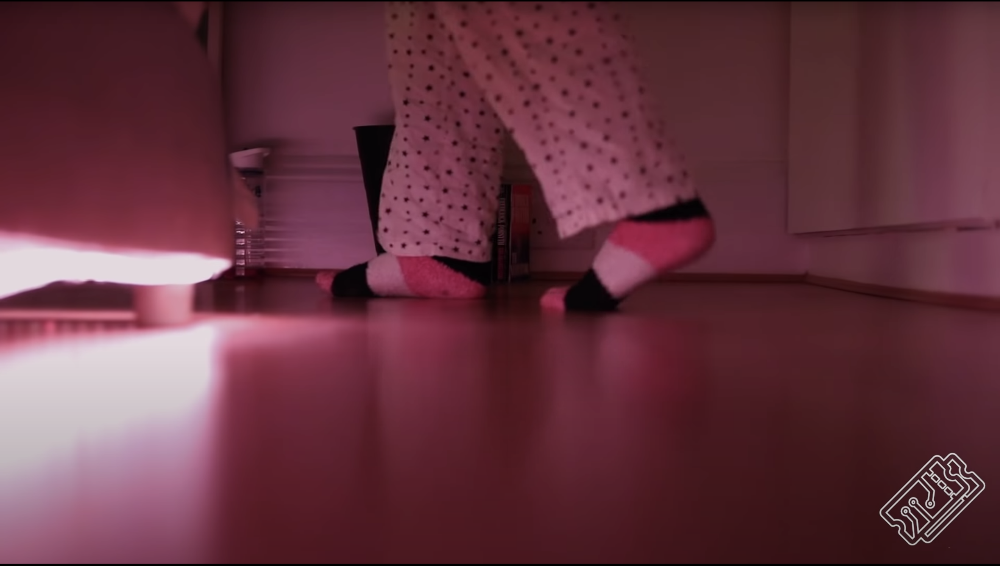

# [T3chFlicks](https://t3chflicks.org): Motion Sensing Under Bed Lighting

> Motion sensing lighting for underneath your bed and controllable with a web app 

Ever tried to get out of bed quietly at night only to trip over something and wake up the whole house? 

Motion sensing night lights installed discreetly under your bed provide low-level light bright enough to guide you around those stray LEGO bricks but dim enough so you're not woken up fully. As well as sensing motion, it's also possible to programme the lights to a colour of your choice for a fixed (or indefinite) length of time. They add a cool glow and ambiance to any bedroom. With some basic kit, a couple of extra bits and our T3ch Flicks tutorial and video, you can install these lights with relative ease in a couple of hours.

🎖️ Featured on [Instructables](https://www.instructables.com/contest/sensors2019/)

---

## `tutorials`

 

---

## 💡 Product Showcase
> 
* 3 Motion sensor positions
* Large dim light activates when motion is detected
* Motion sensor 3d print enclosure
* Storage box 3d print enclosure
* Easy to use with HomeAssistant

---

This project was created by [T3chFlicks](https://t3chflicks.org) - A tech focused education and services company.

---